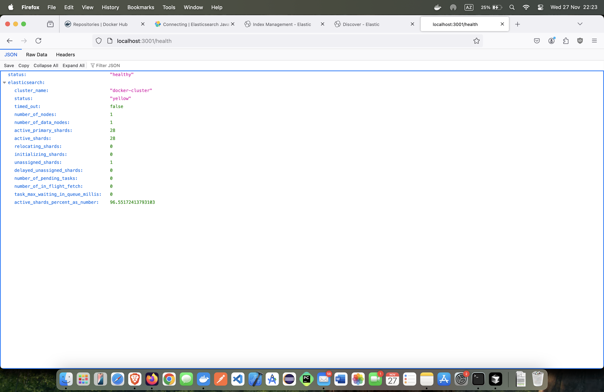
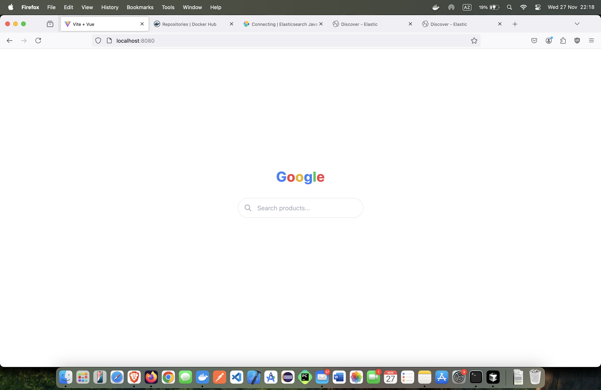
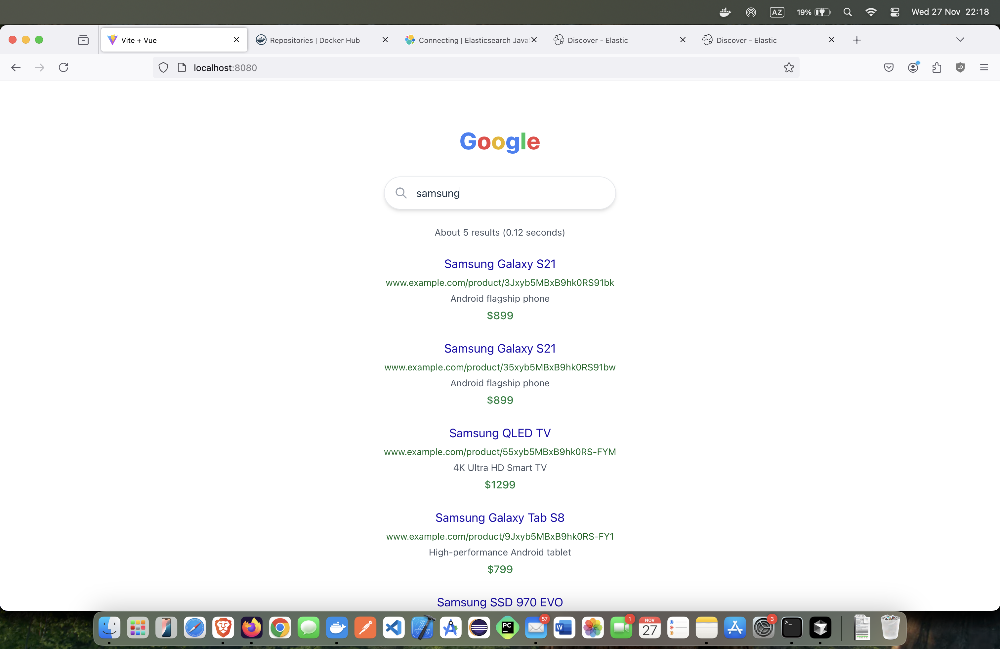
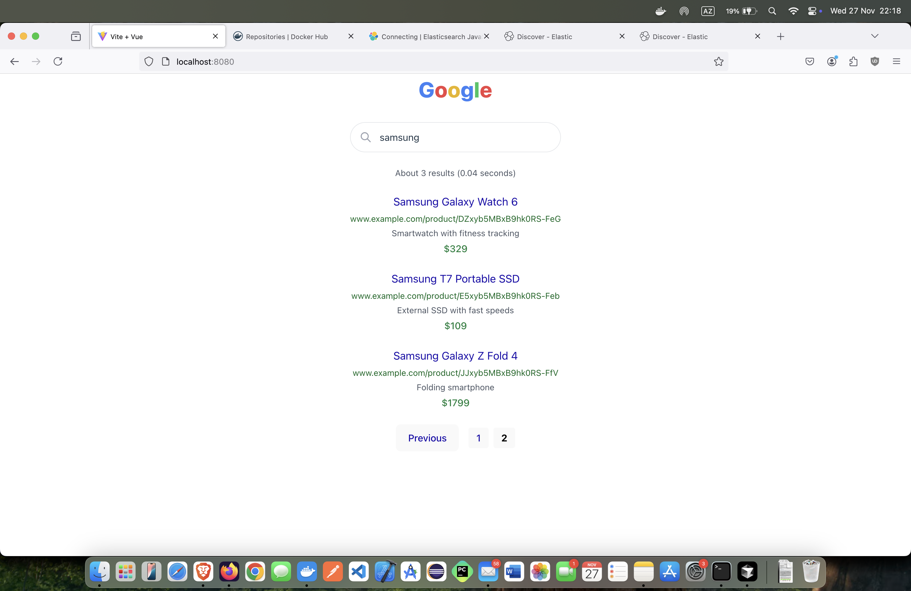
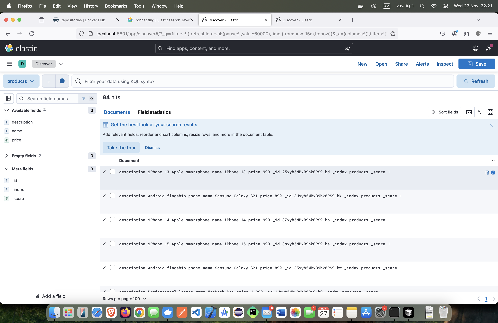
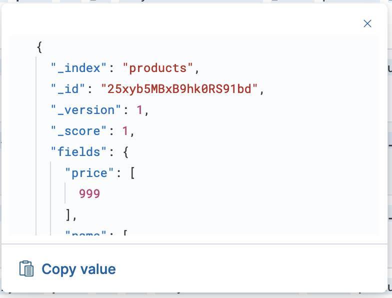
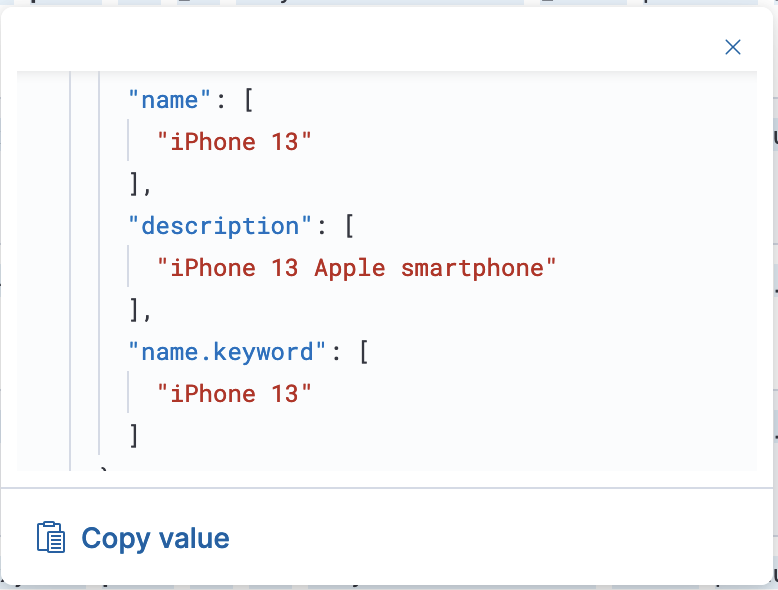
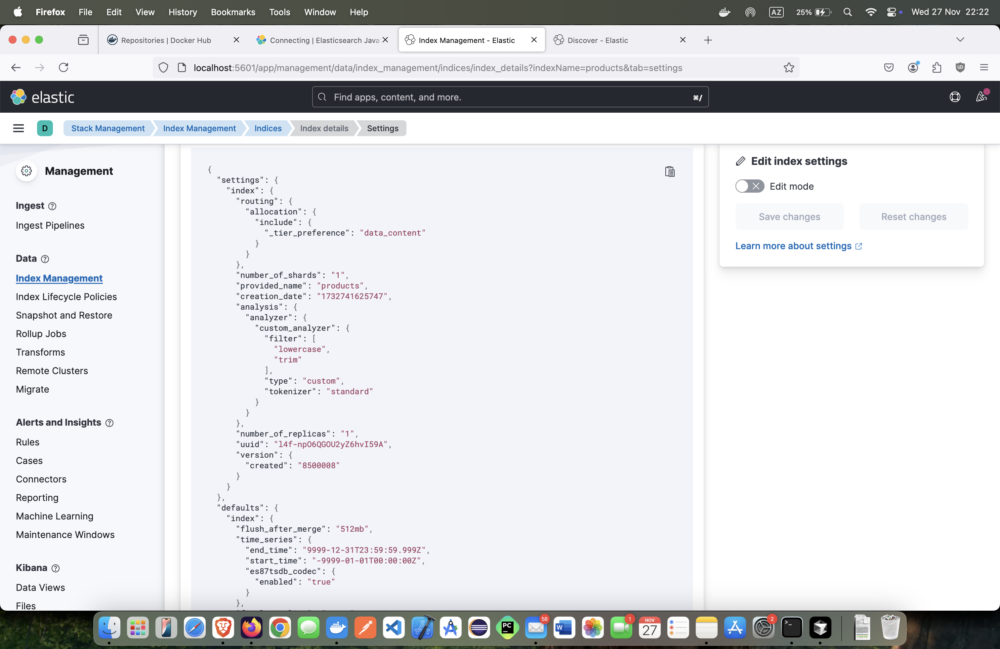
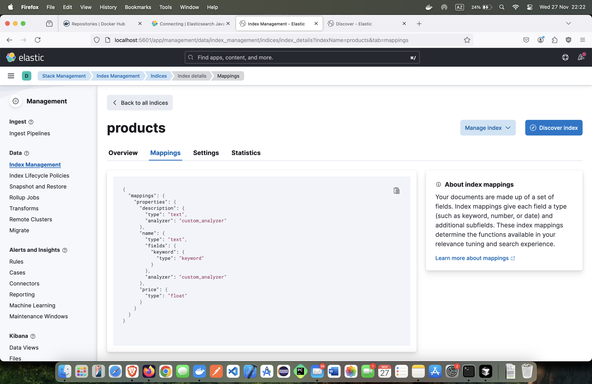

# Elasticsearch Product Search Demo

A full-stack application demonstrating Elasticsearch functionality with a Google-like product search interface. Built with Vue.js, Express.js, and Elasticsearch.

### Health Check


_Health check endpoint to ensure the application is running_

### Home Page (Google-like)


_Initial search interface with Google-like design_

### Exact Match


_Exact match search results_

### Fuzzy Match - Typo with suggestions


_Fuzzy match search results (with typo)_

### Search Pagination


_Search results pagination_

### Kibana Dashboard - Document List


_Search suggestions as you type_

### Kibana Dashboard - Document Details


_Kibana dashboard showing document details_


_Kibana dashboard showing document details_

### Kibana Dashboard - Product Index Settings


_Kibana dashboard showing product index settings_

### Kibana Dashboard - Product Index Mapping


_Kibana dashboard showing product index mapping_

## Features

- 🔍 Real-time product search with exact and fuzzy matching (with suggestions in typo cases)
- 💡 Search suggestions as you type
- 📱 Responsive Google-like interface
- 📊 Search results pagination
- ⚡ Fast search performance
- 📈 Kibana integration for data visualization

## Prerequisites

Before you begin, ensure you have the following installed:

- [Docker](https://docs.docker.com/get-docker/)
- [Docker Compose](https://docs.docker.com/compose/install/)
- Git

## Quick Start

1. Clone the repository:

```bash
git clone https://github.com/hadarisas/elasticsearch-demo.git
cd elasticsearch-demo
cp server/env_example server/env
```

2. Start the application using Docker Compose:

```bash
docker-compose up -d
```

3. Wait for all services to start (this may take a few minutes on first run). You can check the status with:

```bash
docker-compose ps
```

4. Access the application:

- Frontend: http://localhost:8080
- API Server: http://localhost:3001
- Elasticsearch: http://localhost:9200
- Kibana: http://localhost:5601
- Health Check: http://localhost:3001/health

## Architecture

The application consists of four main components:

- **Frontend (Vue.js)**: A responsive web interface running on port 8080
- **Backend (Express.js)**: REST API server running on port 3001
- **Elasticsearch**: Search engine running on port 9200
- **Kibana**: Data visualization platform running on port 5601

## Development Setup

If you want to modify the code and run the services individually:

1. First, start Elasticsearch and Kibana using the development Docker Compose file:

```bash
docker compose -f docker-compose.copy.yml up -d
```

2. Set up the Frontend:

```bash
cd client
npm install
npm run dev
```

The frontend will be available at http://localhost:5173

3. Set up the Backend:

```bash
cd server
cp .env.example .env    # Configure your environment variables
npm install
npm run dev
```

The backend will be available at http://localhost:3001

> **Note:** For development, we use `docker-compose.copy.yml` which only runs Elasticsearch and Kibana services. This allows you to run the frontend and backend services locally while still connecting to the containerized search infrastructure.

## API Endpoints

### Search Products

- **URL**: `/api/search`
- **Method**: `GET`
- **Query Parameters**:
  - `q`: Search query
  - `page`: Page number (default: 1)
  - `limit`: Results per page (default: 5)
- **Example**: `http://localhost:3001/api/search?q=iphone&page=1&limit=5`

### Health Check

- **URL**: `/health`
- **Method**: `GET`
- **Example**: `http://localhost:3001/health`

## Docker Images

The application uses the following Docker images:

- Frontend: `hadarisas/elasticsearch-demo-client:1.0`
- Backend: `hadarisas/elasticsearch-demo-server:1.0`
- Elasticsearch: `docker.elastic.co/elasticsearch/elasticsearch:8.12.0`
- Kibana: `docker.elastic.co/kibana/kibana:8.12.0`

## Troubleshooting

1. **Services not starting:**

   ```bash
   # Check service logs
   docker compose logs -f
   ```

2. **Elasticsearch not healthy:**

   ```bash
   # Check Elasticsearch status
   curl http://localhost:9200/_cluster/health
   ```

3. **Reset everything and start fresh:**
   ```bash
   docker-compose down -v
   docker-compose up -d
   ```

## Data Management

The application comes with pre-loaded sample product data. The data is automatically initialized when the server starts. If you need to reset the data:

1. Stop the containers:

   ```bash
   docker-compose down
   ```

2. Remove the volume:

   ```bash
   docker volume rm elasticsearch-demo_elasticsearch-data
   ```

3. Restart the application:
   ```bash
   docker-compose up -d
   ```

## Contributing

1. Fork the repository
2. Create your feature branch (`git checkout -b feature/AmazingFeature`)
3. Commit your changes (`git commit -m 'Add some AmazingFeature'`)
4. Push to the branch (`git push origin feature/AmazingFeature`)
5. Open a Pull Request

## Contact

EL HADRI HASSAN - hadarisas@gmail.com

Project Link: [https://github.com/hadarisas/elasticsearch-demo](https://github.com/hadarisas/elasticsearch-demo)

## Acknowledgments

- [Elasticsearch Documentation](https://www.elastic.co/guide/index.html)
- [Vue.js](https://vuejs.org/)
- [Express.js](https://expressjs.com/)
- [Docker](https://www.docker.com/)
